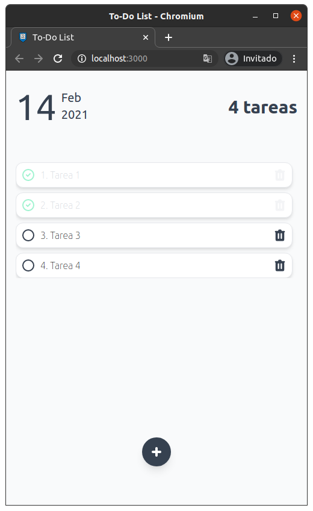

# React To-Do List

To do List desarrollado con React utilizando `create-react-app`, componentes funcionales y los Hooks useReducer, useEffect junto a un custom Hook básico para el manejo de formularios. Los Todos se guardan en el [localStorage](https://developer.mozilla.org/es/docs/Web/API/Storage/LocalStorage).

# Demo
Si desea ver una demo de este proyecto, puedes visitar el siguiente[Link]().

# Instalación y ejecución

Ejecute los siguientes comandos en una consola: 

```
git clone git@github.com:JDK-93/react-todo-list.git
cd react-todo-list
npm install
```
## Vista previa



## Scripts disponibles

En el directorio del proyecto podrá ejecutar los siguientes scripts:

### `npm start`

Ejecuta la aplicación en modo de desarrollo.\
Abra [http://localhost:3000](http://localhost:3000) para verlo en el navegador.\
La página se volverá a cargar si realiza modificaciones.

### `npm test`

Launches the test runner in the interactive watch mode.\
See the section about [running tests](https://facebook.github.io/create-react-app/docs/running-tests) for more information.

### `npm run build`

Crea la aplicación para producción en la carpeta `build`.\
Consulte [implementación](https://facebook.github.io/create-react-app/docs/deployment) para obtener más información.